# ns-3 Direct Code Execution tutorial

Hajime Tazaki (University of Tokyo)

12th May, 2015

---

## Disclaimer (excuse ?)

- This tutorial is based on dce-1.5 and ns-3.22, the contents would be changed as DCE right now has usability issues....
- Point here is *to smell the potentials of DCE*
- You can do whatever you want **IF** you devote certain amount of brain :)

- We will use the Live-CD ISO image, which includes ns-3.22 and dce-1.5 modules.

https://www.nsnam.org/wiki/AnnualTraining2015

>>>

## Survey report

Q: Topic: What kind of topic are you interested in ?

 Topic | count | ratio
 ----|-------|-----------
 TCP in general | 4 | 66.7%
 Routing protocols (e.g. quagga) | 4 | 66.7%
 Custom Linux kernel network stack | 4 | 66.7%
 FreeBSD kernel network stack | 2 | 33.3%
 Linux Multipath TCP | 1 | 16.7%
 Other | 3 | 50%

>>>

## Recipe

- DCE in a nutshell (10 mins)
- Showcases (10 mins)
- Hands-on (60 mins)
 - Quagga ospfd
 - Linux TCP congestion window trace
- Q&A (you can interrupt anytime)


---

## Direct Code Execution in a nutshell

>>>

## What does it look like ?

- Lightweight virtualization of kernel and application processes, interconnected by simulated networks

- Benefits
 - Implementation realism
 - in controlled topologies or wireless environments
 - Model availability
 - Debugging a whole network within a single process

- Limitations
 - Not as scalable as pure simulation
 - Tracing more limited
 - Configuration different

>>>
## Why Direct Code Execution ?

1. You want to investigate a protocol, but the model **isn't available**,
2. You don't want to **maintain two versions of implementation** btw/ ns-3 and (UNIX/POSIX) socket applications,
3. You want to evaluate a protocol implemented in Linux kernel, but
 - it *doesn't scale* much (computation resource of VM)
 - or you want to conduct a (fully) *reproducible experiment*

  
### DCE helps you !

Note:
This will only display in the notes window.

>>>

## A brief history

- Initial discussion (ns-3 goals)
 - Started around 2007 (Lacage)
 - GSoC 2008 (Quagga/Netlink bridge)
- almost 8 years old
 - 7 times official release since April 2013
 - along with ns-3 release (i.e., ns-3.23 == dce-1.6)


>>>

## High-level Overview


- POSIX application on ns-3
- Linux/FreeBSD kernel on ns-3
- ns-3 Application with Linux/FreeBSD kernel (DCE Cradle)

>>>

## Internals

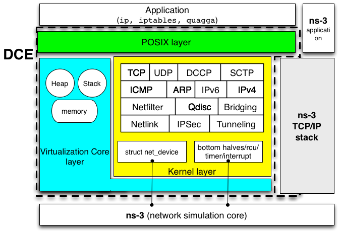

- Virtualization Core Layer
- Kernel layer
- POSIX glue layer

>>>
## How it works ?

- Recompile your code
 - Userspace as Position Independent Executable (PIE)
 - Kernel space code as shared library (libsim-linux.so)

- Run with ns-3
 - Load the executables (binary, library) in an isolated environment among nodes
 - synchronize simulation clocks with apps/kernels clock

>>>
## How to use it ?
- DceManagerHelper / DceApplicationHelper
- (option) LinuxStackHelper
- (option) other submodule helper (QuaggaHelper, Mip6dHelper, etc)
-  (option) Custom command execution

>>>

## Code snippet

~~~c
  // configure DCE with Linux network stack
  DceManagerHelper dce;
  dce.SetNetworkStack ("ns3::LinuxSocketFdFactory", 
                      "Library", StringValue ("liblinux.so"));
  dce.Install (nodes);

  // run an executable at 1.0 second on node 0
  DceApplicationHelper process;
  ApplicationContainer apps;
  process.SetBinary ("your-great-server");
  apps = process.Install (nodes.Get (0));
  apps.Start (Seconds (1.0));
~~~

Note:
```ruby
require 'redcarpet'
markdown = Redcarpet.new("Hello World!")
puts markdown.to_html
```

```javascript
function fancyAlert(arg) {
  if(arg) {
    $.facebox({div:'#foo'})
  }
}
```


>>>

## When is it useful ?

- more realistic simulation (see DCE Cradle paper[3])
- less development effort
- (also) to improve the quality of the real-world code (as a debug/test platform) (see CoNEXT paper[2])

>>>

## What to start with ?

- Quick start (https://www.nsnam.org/docs/dce/release/1.5/manual/html/getting-started.html)

```
mkdir dce
cd dce
bake.py configure -e dce-linux-1.5
bake.py download
bake.py build
```

you can also specify *dce-ns3-1.5* instead.

>>>

## Recent News

- release (1.6)
 - will be released very soon
- Linux upstream
 - posted lkml on March 2015, on the review
 - LWN featured (http://lwn.net/Articles/639333/)


>>>

## Call for Maintainers

**we want to have new maintainer**

- maintain a release of DCE
- fix known bugs in Bugzilla
- introduce new features

**contact Hajime (thehajime at gmail.com) directly**

---

# DCE Showcases

>>>

## Features/Functions

- less development effort
 - quagga, umip, ccnx, bind9, etc
 - Linux kernel (SCTP, DCCP, IPv4/v6), FreeBSD 10.0 kernel (partialy)
 - Out-of-tree Linux kernel Multi-path TCP
- **reproducible** environment for Linux kernel experiment
- development platform
 - debugging facility (gdb, valgrind)
 - code coverage (gcov, etc)

>>>

## Less development effort (DCCP)
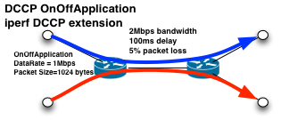
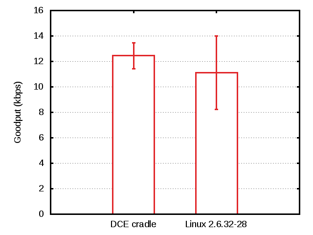

- **10K LoC** of Linux DCCP can be used on ns-3
- with a small amount of code (~10 LoC)!
- and the results are promising

>>>

## Less development effort (DNS/DNSSEC)

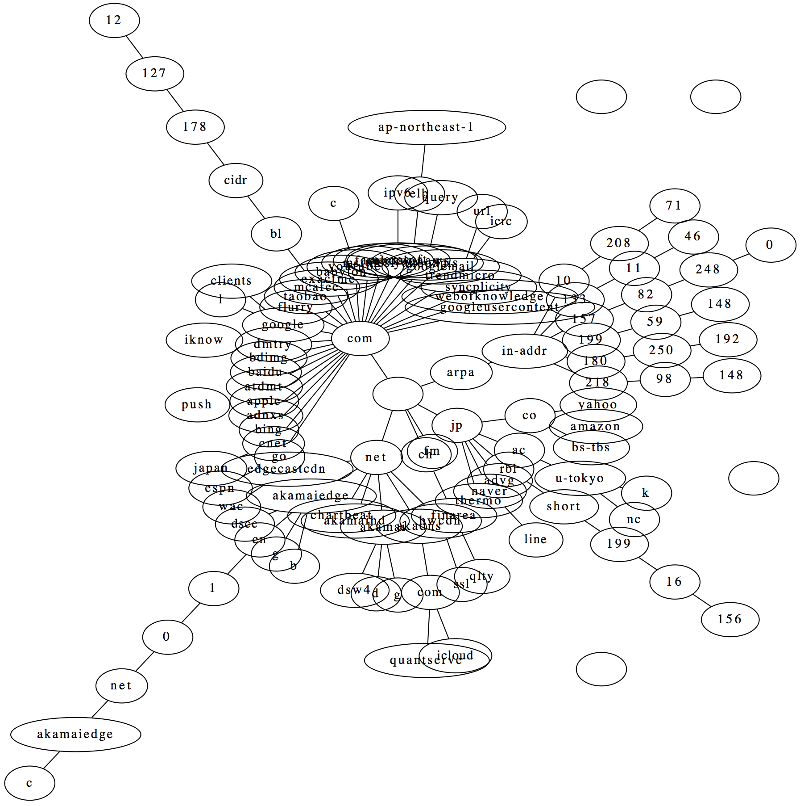
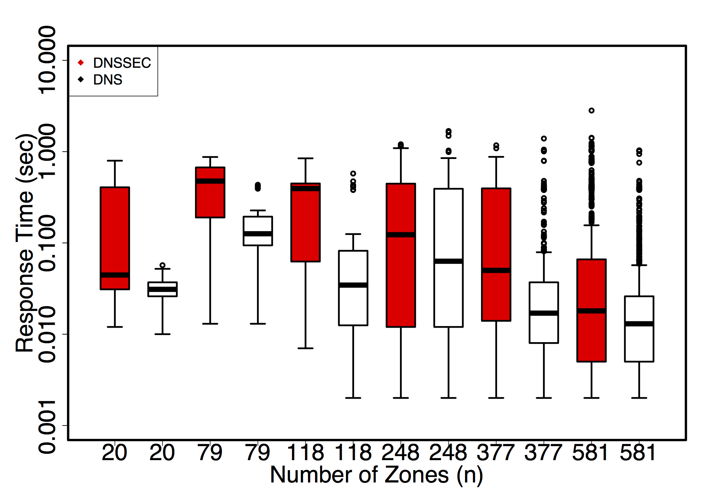

- bind9 zone file => named.conf/unbound.conf (by *createzones*)
- run bind9/unbound (*named*, *dig*, etc) with key-signed operation
- see how response time will be changed
- available at a private repository (http://dnssec.sekiya-lab.info)

>>>

## Less development effort (ccnx)

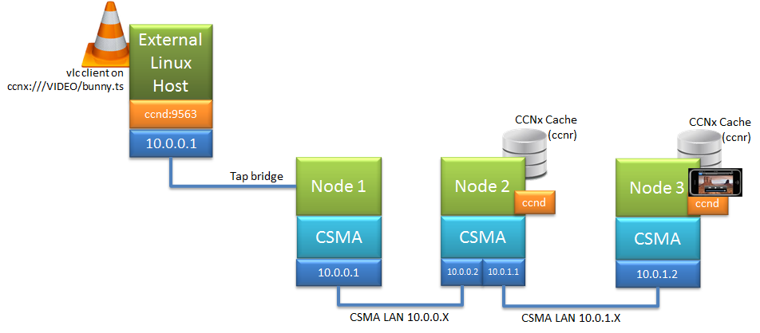

- an alternative for ndn-sim

>>>

## Replication of a past experiment (MPTCP)

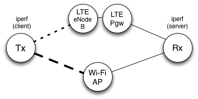
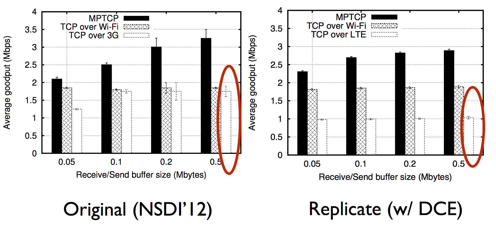

1. picked one figure from a paper (NSDI 2012)
2. replicate an experiment with available information on the paper
3. configure an ns-3 scenario **with** the same software (Linux/iperf)


- no significant goodput improvement with buffer size when DCE in single TCP
- Max goodput range: 2.2 - 2.9Mbps (DCE)  2.0 - 3.2Mbps (NSDI)

>>>

## Development platform (gdb)

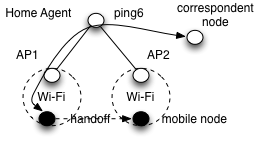
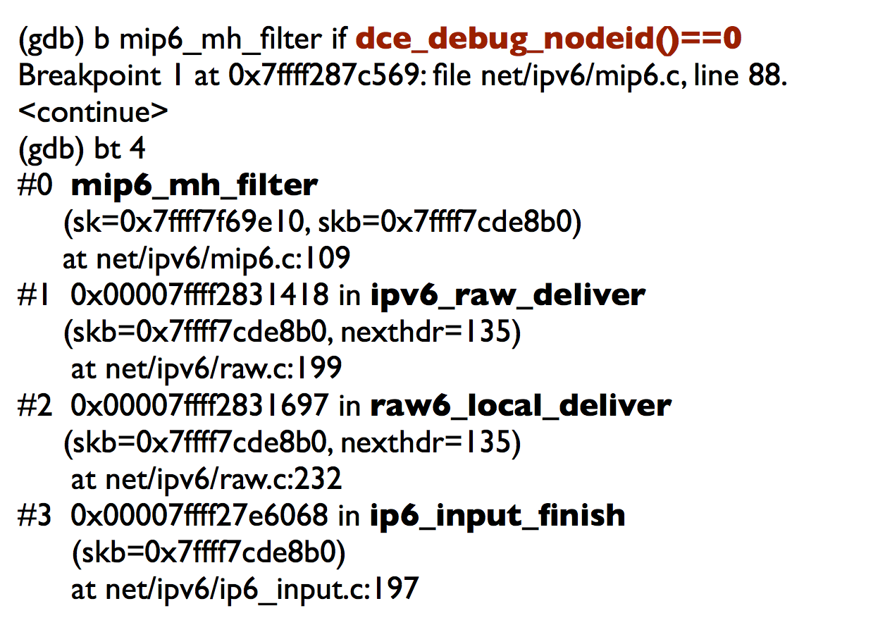

- Inspect codes during experiments
 - among distributed nodes
 - in a single process
- perform a simulation to reproduce a bug
- see how badly handling a packets in Linux kernel

>>>

## Development platform (valgrind)


- Memory error detection
 - among distributed nodes
 - in a single process
- Use **Valgrind**

<!--
>>>

## Development platform (code coverage)


-->

>>>

## Development platform (Jenkins CI)

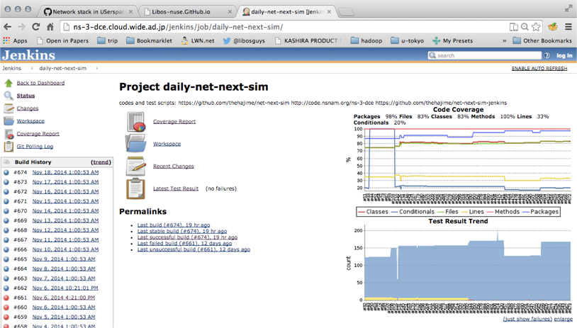

>>>

## Combinations

basic mode (ns-3 stack) and advanced mode (Linux stack)

- ns-3 stack < Linux
 - Linux is more compatible with POSIX apps
 - e.g., more sockopts, full netlink
- ns-3 stack > Linux
 - Tracing features
 - simulation speed

Note:
- ns-3
 - abstract implementation
 - lightweight
- DCE (common)
 - realistic
 -

>>>

## Basic Workflow

- Write a topology
- Run simulation
- Gather outputs
- and do what you want to do

---

# Hands-on 1
### OSPF routing in a real ISP topology

>>>

## Hands-on 1 (30 mins)

 ospfd on rocketfuel topology

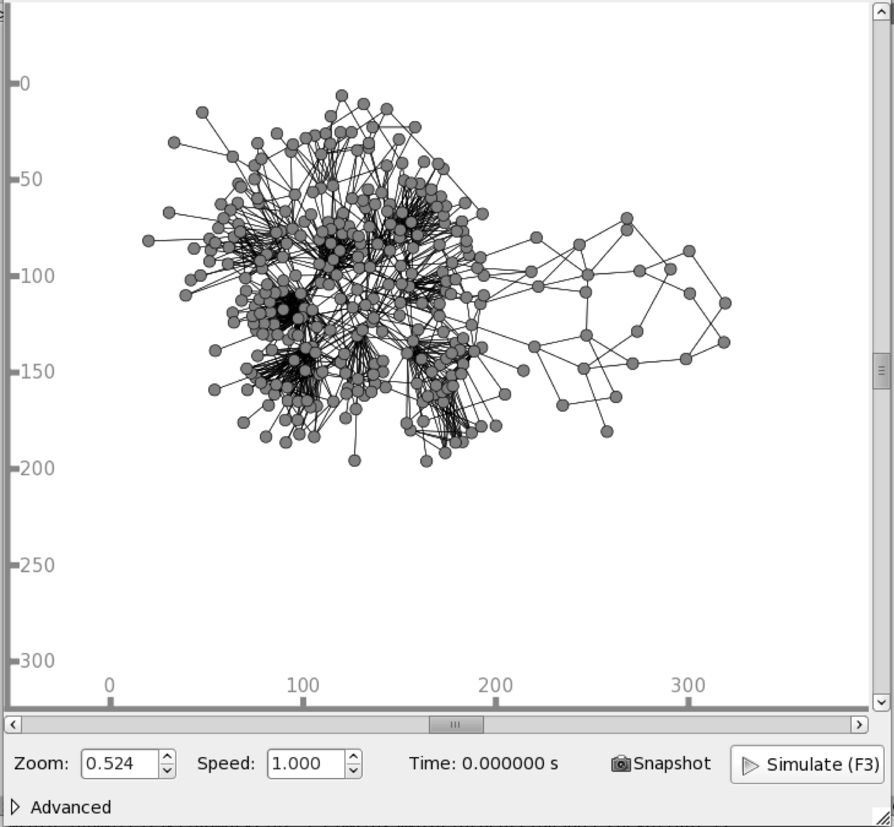

>>>

## Workflow

*Real topology, real routing protocol*

- dce-quagga-ospfd-rocketfuel.cc
- Topology: Rocketfuel topology, AS3967, 79 nodes
- Routing: OSPFv2 (quagga ospfd), all area 0
- Traffic: ns3::V4Ping

>>>

## Script review

```
gedit ~/training/bake/source/ns-3-dce/myscripts/\
ns-3-dce-quagga/example/dce-quagga-ospfd-rocketfuel.cc
```
http://code.nsnam.org/thehajime/ns-3-dce-quagga/file/eafaa128a2fe/example/dce-quagga-ospfd-rocketfuel.cc

>>>

## Run simulation

```
cd training/bake/source/ns-3-dce
./waf --run dce-quagga-ospfd-rocketfuel --vis
```

You should see the result something like below.

```
scanning topology: 79 nodes...
scanning topology: calling graphviz layout
scanning topology: all done.
PING  10.0.2.18.26 56(84) bytes of data.
64 bytes from 10.0.2.18: icmp_seq=32 ttl=63 time=8 ms
64 bytes from 10.0.2.18: icmp_seq=33 ttl=63 time=8 ms
64 bytes from 10.0.2.18: icmp_seq=34 ttl=63 time=8 ms
64 bytes from 10.0.2.18: icmp_seq=35 ttl=63 time=8 ms
64 bytes from 10.0.2.18: icmp_seq=36 ttl=63 time=8 ms
64 bytes from 10.0.2.18: icmp_seq=37 ttl=63 time=8 ms
64 bytes from 10.0.2.18: icmp_seq=38 ttl=63 time=8 ms
```

>>>

## What happened ?

Look at the output files generated by *simulated* processes

```
ls files-0/var/log/(pid)/
```

- under files-X/ directories
 - cmdline: executed command with the arguments
 - stdout: log output to *stdout* by the process
 - stderr: log output to *stderr* by the process
 - status: internal status information
 - syslog: (optional) syslog info if the process uses


```
cat files-0/var/log/*/cmdline
```


>>>

## Speedup the simulation

- Use custom *elf-loader*, instead of the system's one
- pass **--dlm** option to the waf

```
./waf --run ABC --dlm
```

- You should get

Loader+Fiber | Time (MM:SS.ss)
-------------|-----------------
Cooja (non-vdl) + Pthread (default)| 11:49.81
Dlm (vdl) + Ucontext (with --dlm)| 2:29.21

Note:
Cooja (non-vdl) + Ucontext| 3:58.30 
Dlm (vdl) + Pthread| 8:01.71 

>>>

## Customize the script

- Change the topology file

```
vi ~/training/bake/source/ns-3-dce/myscripts/ns-3-dce-quagga/\
example/3967.weights.intra
```

- Then run the simulation again

```
cd training/bake/source/ns-3-dce
./waf --run dce-quagga-ospfd-rocketfuel --vis
```

>>>

## Summary

- Quagga ospfd with QuaggaHelper
- Import a Rocketfuel topology (AS3967)
- Verify the connectivity with ns3::V4Ping

### Further steps
- Use distributed simulator (MPI) for the speedup
- Larger topology files

---

# Hands-on 2
### TCP congestion window trace with Linux kernel

>>>

## Hands-on 2 (30 mins)

- Customize DCE environment out of bake installation

- **TCP cwnd** trace with Linux kernel
 - latest Linux (Linux 4.1.0-rc1)
 - ss (in iproute2)
 - an example of DCE simulation *extending* pre-installed modules

Note:
- There is no available bakeconf.xml and example: need to customize by yourselves

>>>

## Setup (Installation)

- get the latest net-next-sim and iproute2 code
- *iproute2* at least requires Linux 3.18.0 or later

```
git clone --depth=1 \
 https://github.com/direct-code-execution/net-next-sim -b wns3-2015
git clone --depth=1 \
 https://git.kernel.org/pub/scm/linux/kernel/git/shemminger/iproute2.git
```

- obtain a script

```
wget https://gist.githubusercontent.com/thehajime/5e9e05ea2df08141ae47/raw/\
a23387aa97b58bc13ccf96a1a208ddd387c9646f/nat-dce-tcp-ns3-nsc-comparison.cc
mv nat-dce-tcp-ns3-nsc-comparison.cc ns-3-dce/myscripts
```

you will see nat-dce-tcp-ns3-nsc-comparison.cc

>>>

## build net-next-sim

```
cd net-next-sim
make defconfig ARCH=lib
make library ARCH=lib
cp libsim-linux-4.1.0-rc1.so ~/training/bake/build/bin_dce/
cd ~/training/bake/build/bin_dce/
ln -s -f libsim-linux-4.1.0-rc1.so liblinux.so
```

*1 ARCH=lib has been changed: we used ARCH=sim in the past.

>>>

## build iproute2

```
cd iproute2
./configure
CFLAGS+=-fpic CFLAGS+=" -D_GNU_SOURCE" CFLAGS+=" -O0" CFLAGS+="\
 -U_FORTIFY_SOURCE" CFLAGS+=" -g" LDFLAGS=-pie \
 LDFLAGS+=" -rdynamic" make
cp misc/ss ~/training/bake/build/sbin/
```

- the latest iproute2 (newer than 3.18.0) has full TCP_INFO support *via netlink*

>>>

## Re-build DCE

DCE requires to rebuild to adapt newer API of net-next-sim.

```
cd ns-3-dce
hg pull -u
./waf configure --prefix=/home/ns3/training/bake/build \
 --with-ns3=/home/ns3/training/bake/build \
 --with-elf-loader=/home/ns3/training/bake/build/lib \
 --with-libaspect=/home/ns3/training/bake/build \
 --enable-kernel-stack=/mnt/net-next-sim/arch
./waf
```

- you need to update the latest ns-3-dce (dce-1.6) 
 - to run with the latest Linux kernel with DCE patch


>>>

## Run script

```
rm -rf files-*
./waf --run "nat-dce-tcp-ns3-nsc-comparison \
  --transport_prot=TcpNewReno --error_p=0.001"
```

- The simulation generates TCP traffic (via LinuxSocketFdFactory: DCE Cradle)
- 10Mbps, 45msec delay on PointToPointNetdevice

>>>

## Generate a plot

```
grep cwnd files-0/var/log/*/stdout | sed "s/.*\(cwnd:.*\s\)ssth.*/\1/" | \
   sed "s/.*\(cwnd:.*\s\)send.*/\1/" | \
   sed "s/.*\(cwnd:.*\s\)lastsnd.*/\1/" | \
   sed "s/cwnd://"  > /tmp/cwnd.dat
gnuplot
gnuplot> plot "/tmp/cwnd.dat" using 0:($1*1446) \
         w lp title "Linux reno"
```

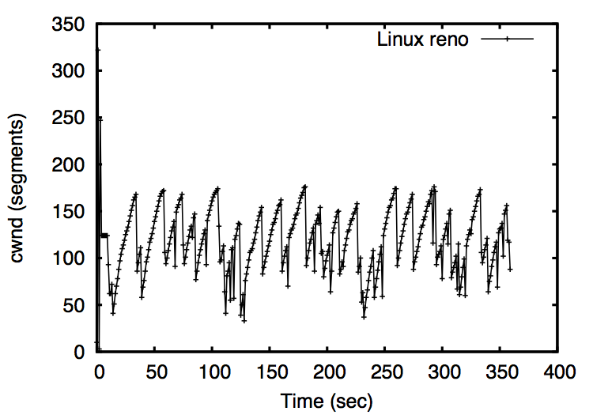

### Voila ! <!-- .element: class="fragment" data-fragment-index="1" -->

>>>

## Summary

- Congestion window trace with Linux TCP stack
- How to customize DCE which was installed by bake
- this contents will be included in future DCE release

---

## The end of tutorial

- Walk-through tutorial of Direct Code Execution
- Documents, papers, examples
- Hands-on (Quagga ospfd, Linux TCP)


>>>

## End notes

- Be patient :)
 - Real-world program is not always familiar with ns-3
 - not integrated with (ns-3) script/helper
 - sparse documents/tools/output
 - but you will get certain benefits !

>>>

## References

- [1] Lacage. Experimentation Tools for Networking Research. PhD thesis, 2010
- [2] Tazaki et al. Direct Code Execution: Revisiting Library OS Architecture for Reproducible Network Experiments, CoNEXT 2013
- [3] Tazaki et al. DCE Cradle: Simulate Network Protocols with Real Stacks for Better Realism, WNS3 2013
- [4] Camara et al. DCE: Test the Real Code of Your Protocols and Applications over Simulated Networks, IEEE Communications Magazine, March 2014

### Contact

- Web (https://www.nsnam.org/overview/projects/direct-code-execution/)
- Mailing list (ns-3-users@googlegroups.com)
- Github (https://github.com/direct-code-execution)


>>>

# Questions ?
